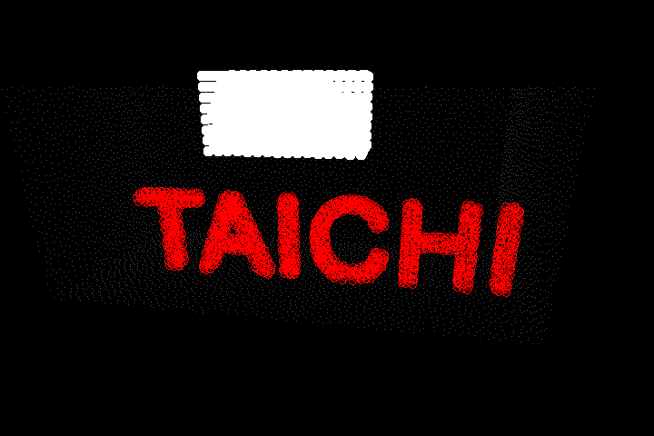
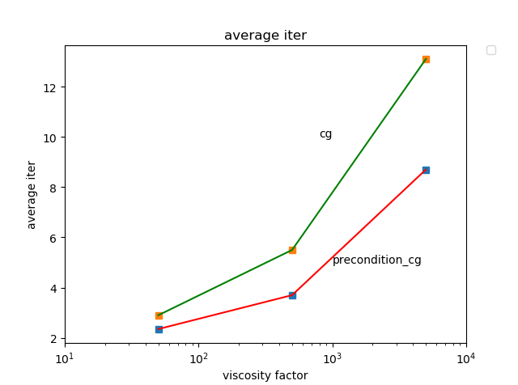
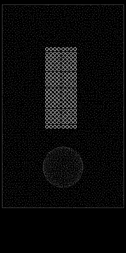
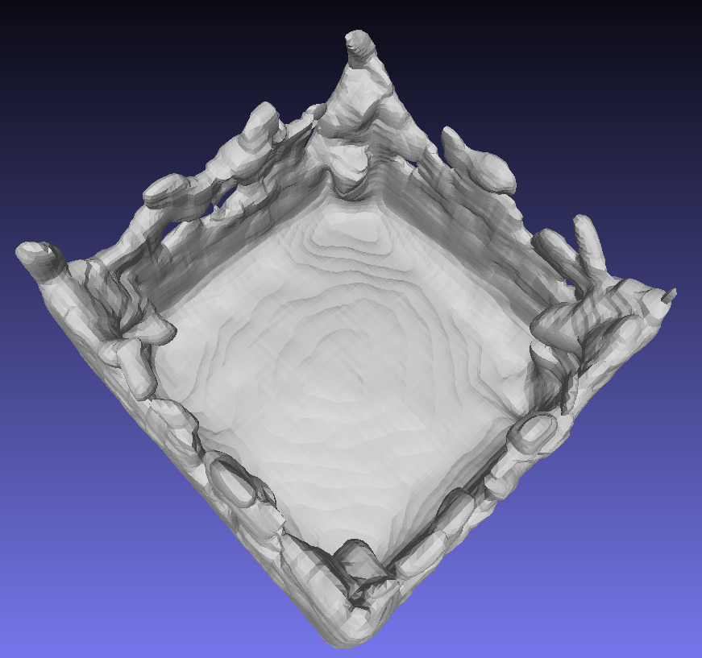

# Weakly compressed liqiud simulation

- The code is mainly code transplanted from [SPlisHSPlasH](https://github.com/InteractiveComputerGraphics/SPlisHSPlasH)

- The code use [Taichi](https://github.com/taichi-dev/taichi) programming language

---

## Current implement algorithm
* [SESPH] 
* [PCISPH]
* [IISPH]
* [DFSPH]
---

## How to run 
* First config your anaconda workspace, and open the anaconda prompt
* Second you need install [taichi](https://github.com/taichi-dev/taichi) language, **pip install taichi**
* Last you type **ti dfsph.py**, that's all
---

## Some image produced by this project

### Possion disk sample(full parallel) for boundry handling

---

###  Implicit viscosity solver 

---

###  Use precondition cg to solve viscosity:

---

###  Surface tension (without & with):

 

---

###  anistropic mesh restruction :

- marching cube 

- using anistropic kernel to build the volume field

- render image

---

###  Other algorithm:

- hash grid

- cfl time step
---
# Referrence

- M Weiler 2018: A physically consistent implicit viscosity solver for SPH fluids

- Nadir Akinci 2013: Versatile surface tension and adhesion for SPH fluids

- JIHUN YU 2013: Reconstructing Surfaces of Particle-Based Fluids. Using Anisotropic Kernels. 

